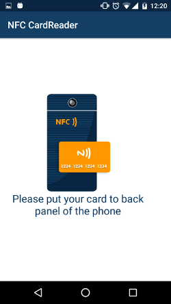
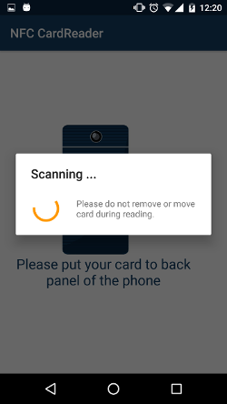
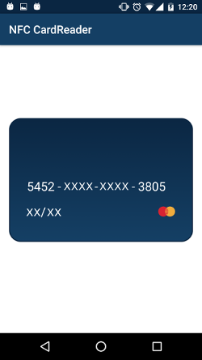

# Credit Card NFC Reader
[](https://android-arsenal.com/details/1/3501)

This library helps developer to read data from credit card: card number, expired date, card type.<br>
<i>Works only with cards that has paypass or paywave technology!</i>

1. [Demo](https://play.google.com/store/apps/details?id=com.pro100svitlo.nfccardread)
2. [Screenshots](#screenshots)
3. [Usage](#usage)
4. [Callbacks](#callbacks)
5. [Proguard](#proguard)
5. [Updates](#updates)
6. [License](#license)

# Screenshots




# Usage
##### Add the dependencies to your gradle file:
```sh
    dependencies {
        	        implementation 'com.github.LouisP79:creditCardNfcReader:v1.2'
    }
```

##### Inside your Manifest:
```sh
    <uses-permission android:name="android.permission.NFC" />
    <application
        ...
        >
        <activity
            ...
            //activity that will start when nfc scan new tag
            >
            <intent-filter>
                <action android:name="android.nfc.action.TECH_DISCOVERED" />
                <category android:name="android.intent.category.DEFAULT" />
            </intent-filter>
            <meta-data
                android:name="android.nfc.action.TECH_DISCOVERED"
                android:resource="@xml/nfc_tech_filter" />
        </activity>
```
##### Add the xml file 'nfc_tech_filter':
```sh
    <resources >
      <tech-list>
          <tech>android.nfc.tech.IsoDep</tech>
      </tech-list>
    </resources>
```

##### Inside your activity or fragment:
```sh
    @Override
    protected void onCreate(Bundle savedInstanceState) {
    ...
        mNfcAdapter = NfcAdapter.getDefaultAdapter(this);
        if (mNfcAdapter == null){
            //do something if there are no nfc module on device
        } else {
            //do something if there are nfc module on device
            
            mCardNfcUtils = new CardNfcUtils(this);
            //next few lines here needed in case you will scan credit card when app is closed
            mIntentFromCreate = true;
            onNewIntent(getIntent());
        }
    }
    ...
    @Override
    protected void onResume() {
        super.onResume();
        mIntentFromCreate = false;
        if (mNfcAdapter != null && !mNfcAdapter.isEnabled()){
            //show some turn on nfc dialog here. take a look in the samle ;-)
        } else if (mNfcAdapter != null){
            mCardNfcUtils.enableDispatch();
        }
    }
    ...
    @Override
    public void onPause() {
        super.onPause();
        if (mNfcAdapter != null) {
            mCardNfcUtils.disableDispatch();
        }
    }
    ...
    @Override
    protected void onNewIntent(Intent intent) {
        super.onNewIntent(intent);
        if (mNfcAdapter != null && mNfcAdapter.isEnabled()) {
            //this - interface for callbacks
            //intent = intent :)
            //mIntentFromCreate - boolean flag, for understanding if onNewIntent() was called from onCreate or not
            mCardNfcAsyncTask = new CardNfcAsyncTask.Builder(this, intent, mIntentFromCreate)
                    .build();
        }
    }
```
That's pretty much all what you need to start the work!

---

### Callbacks:

This is the main callback for managing:
 
```sh
    @Override
    public void startNfcReadCard() {
        //notify user that scannig start
    }

    @Override
    public void cardIsReadyToRead() {
        String card = mCardNfcAsyncTask.getCardNumber();
        String expiredDate = mCardNfcAsyncTask.getCardExpireDate();
        String cardType = mCardNfcAsyncTask.getCardType();
    }

    @Override
    public void doNotMoveCardSoFast() {
        //notify user do not move the card
    }

    @Override
    public void unknownEmvCard() {
        //notify user that current card has unnown nfc tag
    }

    @Override
    public void cardWithLockedNfc() {
        //notify user that current card has locked nfc tag
    }

    @Override
    public void finishNfcReadCard() {
        //notify user that scannig finished
    }
```

### Proguard
If you are using Proguard, please add this line to your proguard-rules.pro file
```
-keep class com.noveogroup.android.log.** { *; }
```

### Updates
* v.1.0.0
    1. Add Ingdirect Bank visa card (Australian Bank)
    2. Add default card type as <b>UNKNOWN</b>.


### License
The MIT License (MIT)

Copyright (c) 2016 Credit Card NFC Reader

Permission is hereby granted, free of charge, to any person obtaining a copy
of this software and associated documentation files (the "Software"), to deal
in the Software without restriction, including without limitation the rights
to use, copy, modify, merge, publish, distribute, sublicense, and/or sell
copies of the Software, and to permit persons to whom the Software is
furnished to do so, subject to the following conditions:

The above copyright notice and this permission notice shall be included in all
copies or substantial portions of the Software.

THE SOFTWARE IS PROVIDED "AS IS", WITHOUT WARRANTY OF ANY KIND, EXPRESS OR
IMPLIED, INCLUDING BUT NOT LIMITED TO THE WARRANTIES OF MERCHANTABILITY,
FITNESS FOR A PARTICULAR PURPOSE AND NONINFRINGEMENT. IN NO EVENT SHALL THE
AUTHORS OR COPYRIGHT HOLDERS BE LIABLE FOR ANY CLAIM, DAMAGES OR OTHER
LIABILITY, WHETHER IN AN ACTION OF CONTRACT, TORT OR OTHERWISE, ARISING FROM,
OUT OF OR IN CONNECTION WITH THE SOFTWARE OR THE USE OR OTHER DEALINGS IN THE
SOFTWARE.
